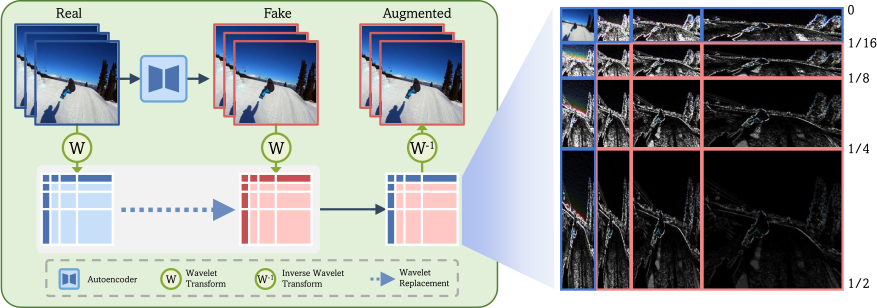

# Seeing What Matters: Generalizable AI-generated Video Detection with Forensic-Oriented Augmentation

Official PyTorch implementation of the NeurIPS 2025 paper "Seeing What Matters: Generalizable AI-generated Video Detection with Forensic-Oriented Augmentation". Riccardo Corvi, Davide Cozzolino, Ekta Prashnani, Shalini De Mello, Koki Nagano, Luisa Verdoliva.

## News
* 2025-11-28: demo release.

## Overview

 

 In this work, first, we study different generative architectures, searching and identifying discriminative features that are unbiased, robust to impairments, and shared across models. Then, we introduce a novel forensic-oriented data augmentation strategy based on the wavelet decomposition and replace specific frequency-related bands to drive the model to exploit more relevant forensic cues. Our novel training paradigm improves the generalizability of AI-generated video detectors, without the need for complex algorithms and large datasets that include multiple synthetic generators. To evaluate our approach, we train the detector using data from a single generative model and test it against videos produced by a wide range of other models. Despite its simplicity, our method achieves a significant accuracy improvement over state-of-the-art detectors and obtains excellent results even on very recent generative models, such as NOVA and FLUX.

## Demo

You can find the code to run the method’s demo in the demo folder. For more details, check the accompanying README file.

## License

The license of the code can be found in the LICENSE.md file.

